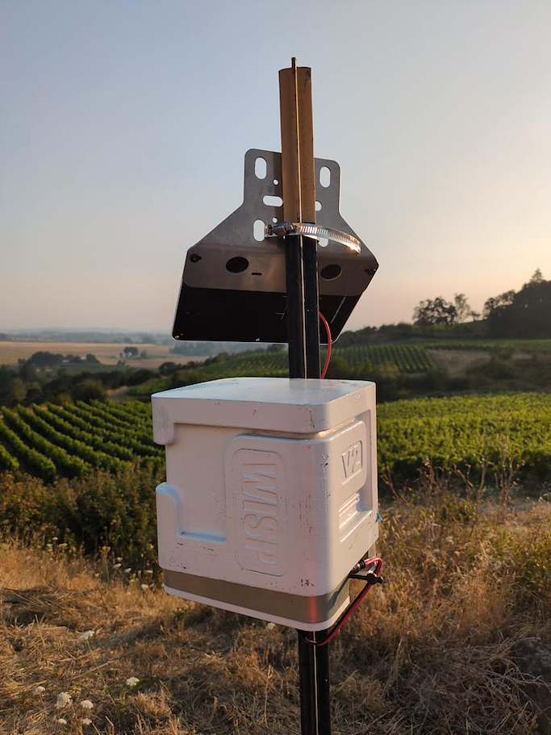
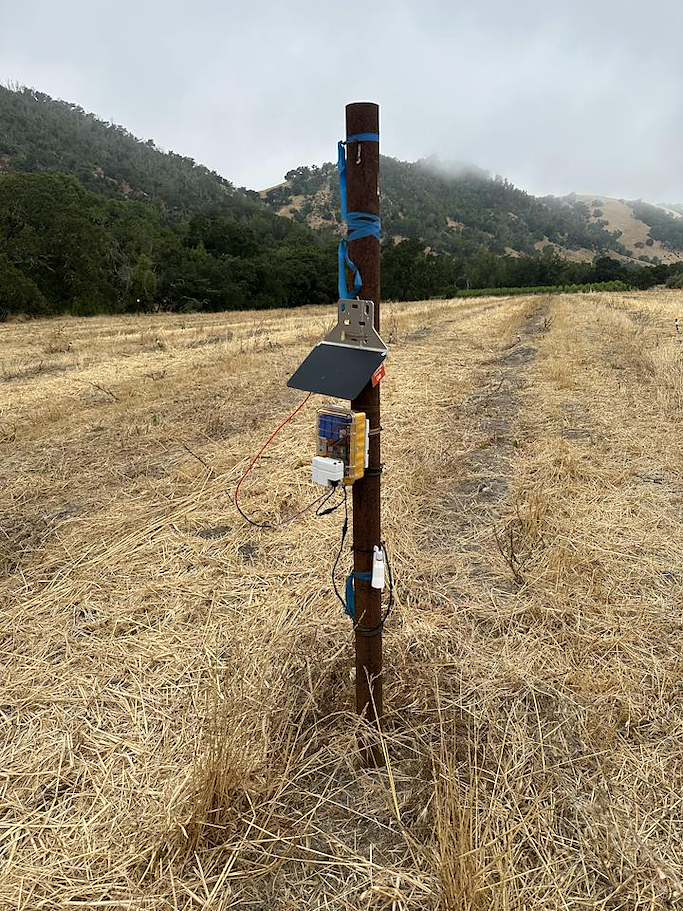
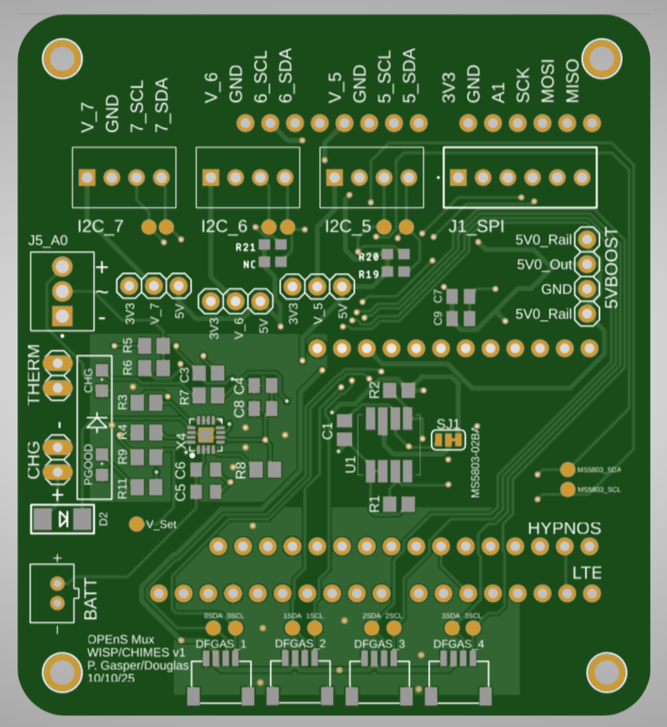
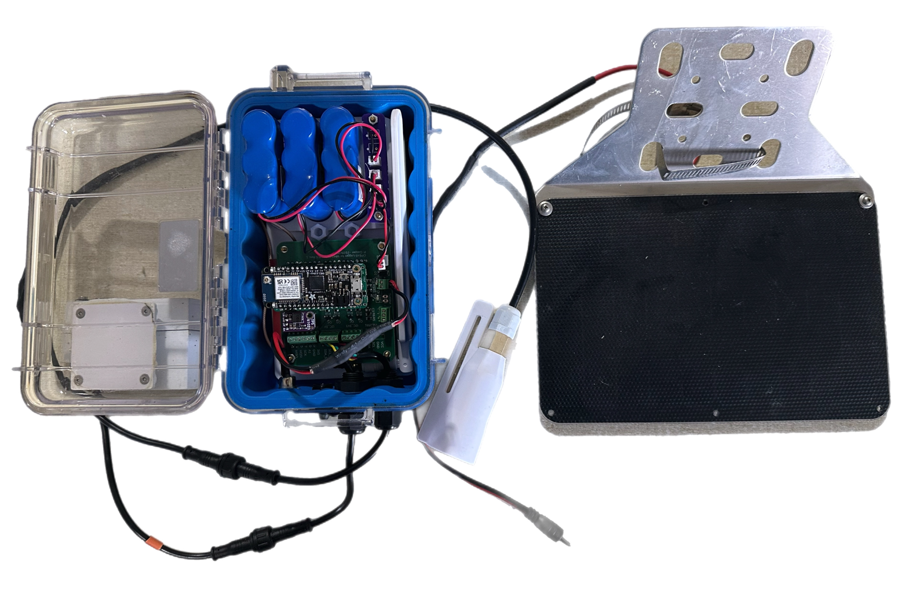
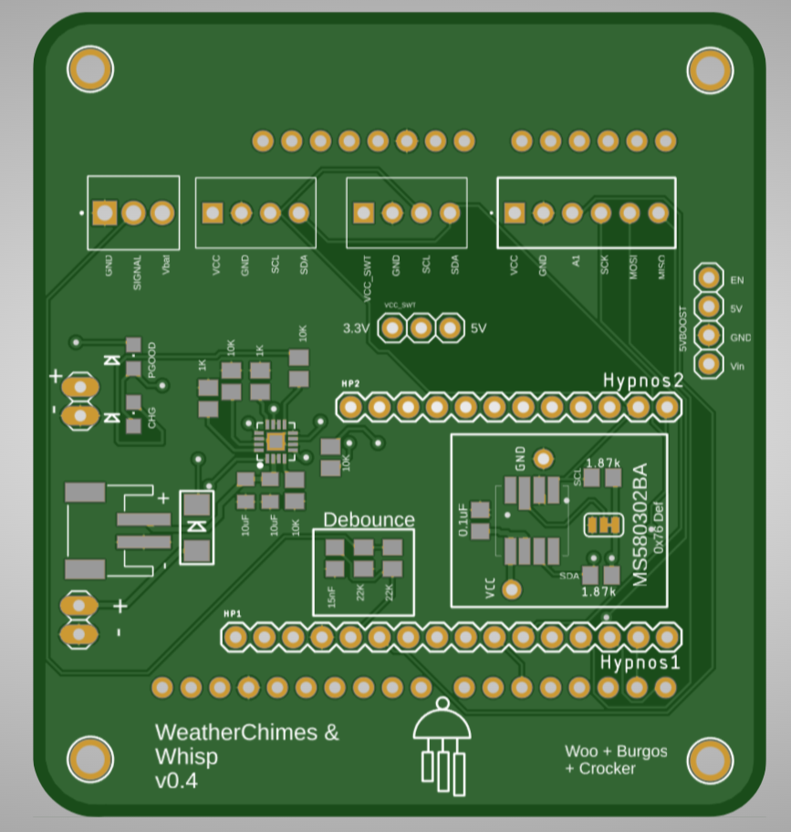
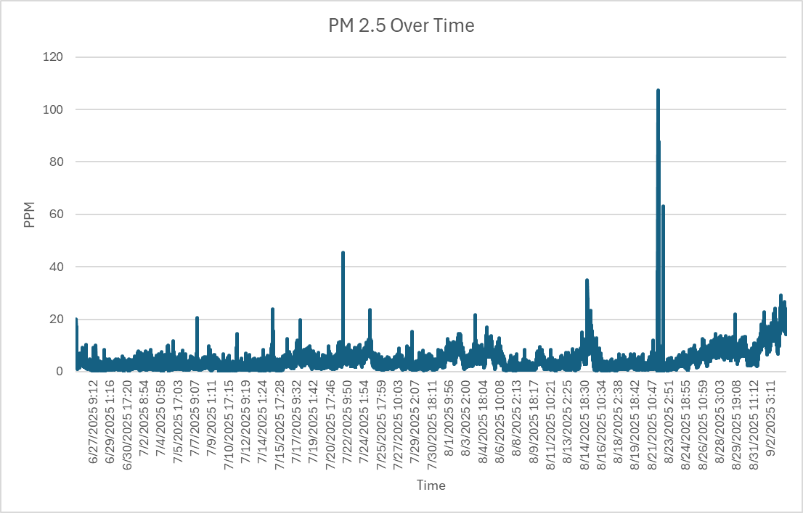
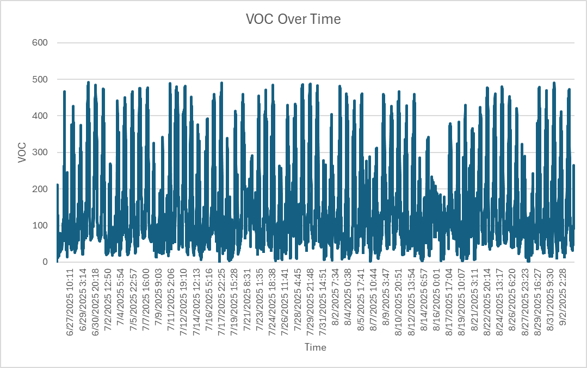
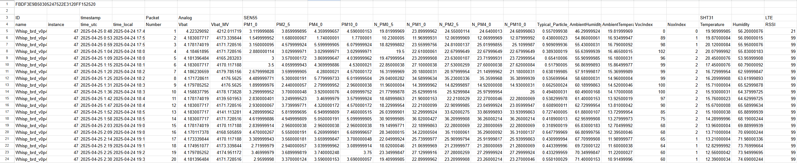

<!-- omit in toc -->
# Wisp
An open-source remote air quality sensing device made by OPEnS Lab OSU. The device logs air quality parameters to the MongoDB database.

Project leads: **Quinn Yockey** \<yockeyq@oregonstate.edu\>, **Shion Britten** \<brittesh@oregonstate.edu\>

<!-- omit in toc -->
## Abstract
Wildfires across Oregon, Washington, and California pose a significant threat to the wine industry through smoke taint, which negatively impacts wine quality. Accurate, high-resolution data on smoke exposure at the vineyard level is critical for risk assessment, yet commercial devices can be high cost. To address this, OPEnS Lab has developed Wisp, an Arduino-based air quality monitoring device:
* Data is being used with analysis of actual grape samples in effort to model smoke taint risk
* Measures 12 air quality parameters including particulate matter, CO₂, CO, SO₂
* Solar battery charger and 4G telemetry allows use in remote locations
* Low-cost (under $1500) compared to commercial competitors
* Open-source software and hardware

    
    

  
Figure 1 (Left): Deployed Wisp v2 Unit

  
Figure 2 (Right): Deployed Wisp v1 Unit

<!-- omit in toc -->
## Table of Contents
- [Wisp V2](#wisp-v2)
  - [Wisp V2 Sensor Specs](#wisp-v2-sensor-specs)
  - [Sleep and Data Logging](#sleep-and-data-logging)
  - [Wireless Data Access](#wireless-data-access)
- [Wisp V1](#wisp-v1)
  - [Wisp V1 Sensor Specs](#wisp-v1-sensor-specs)
  - [Current Draw Test](#current-draw-test)
  - [Deployment History](#deployment-history)
- [Resource List](#resource-list)
  - [Sensor Datasheets](#sensor-datasheets)
  - [LTE Board](#lte-board)
  - [SAMD Microprocessor](#samd-microprocessor)
  - [In-House PCB Schematics](#in-house-pcb-schematics)
  - [Bill of Materials](#bill-of-materials)
  - [Power Budget](#power-budget)
  - [Build Guide](#build-guide)

## Wisp V2

The Wisp V2 is an expansion on the Wisp, significantly expanding the device's compatibility. Beyond standard Particulate Matter (1.0–10.0), VOC, NOx, and tempurature/humidity readings in all Wisp units, the V2 switches out the SEN55 for the SEN66, which additionally supports Carbon Dioxide (CO₂) sensing. The V2 architecture also integrates an I²C multiplexer to support several DFRobot Gravity gas sensors (including CO, O₃, and SO₂) as well as any other I²C sensors with Loom integration. This allows users to swap sensor modules dynamically to suit specific deployment environments without redesigning the hardware. The device is housed in a custom 3D-printed waterproof enclosure designed to accommodate up to five 10050 mAh batteries, significantly extending operational runtime compared to the V1. The Wisp v2 began deployment in May 2026.

### Wisp V2 Sensor Specs

| **Specification** | **Sensor** | **Repeatability** | **Accuracy** | **Full Range** |
| :--- | :---: | :---: | :---: | :---: |
| Ambient Temperature | SHT31 | ±0.07 °C | ±0.3 °C | -40 to 125 °C |
| Humidity | SHT31 | ±0.015 %RH | ±2 %RH | 0 to 100 %RH |
| Carbon Dioxide (CO₂) | SEN66 | ±10 ppm | ± (50 ppm + 2.5 % m.v.) | 0 to 40000 ppm |
|  |  | **Repeatability** | **Device Variation** | **Full Range** |
| Volatile Organic Compounds | SEN66 |±5 VOC index or ±5% m.v. | ±15 VOC index or ±15% m.v. | 1 to 500 VOC index |
| Nitrogen Oxides Index | SEN66 |±10 NOx index or ±10% m.v. | ±50 NOx index or ±50% m.v. | 1 to 500 NOx index |
|  |  | **Max Drift** | **Precision** | **Full Range** |
| Particulate Matter 1.0 | SEN66 | ±1.25 μg/m³/yr to ±1.25 % m.v./yr  | ±(5 μg/m³ + 5 % m.v.) to ±10 % m.v. | 0 to 1000 μg/m³ |
| Particulate Matter 2.5 | SEN66 |±1.25 μg/m³/yr to ±1.25 % m.v./yr  | ±(5 μg/m³ + 5 % m.v.) to ±10 % m.v. | 0 to 1000 μg/m³ |
| Particulate Matter 4.0 | SEN66 | ±1.25 μg/m³/yr to ±1.25 % m.v./yr | ±25 μg/m³ to ±25 % m.v. | 0 to 1000 μg/m³ |
| Particulate Matter 10 | SEN66 |±1.25 μg/m³/yr to ±1.25 % m.v./yr  | ±25 μg/m³ to ±25 % m.v. | 0 to 1000 μg/m³ |
|  |  | **Resolution** | **Accuracy** | **Full Range** |
| Carbon Monoxide (CO) | SEN0466 | 1 ppm | ±10% | 0 to 1000 ppm |
| Sulfur Dioxide (SO₂) | SEN0470 | 0.1 ppm | ±10% | 0 to 20 ppm |
| Ozone (O₃) | SEN0472 | 0.1 ppm | ±10% | 0 to 10 ppm |

Table 1: Wisp v2 Sensor specifications, '% m.v.' means '% of measured value'. 

### Sleep and Data Logging

The default logging period of 5 minutes is arbitrary and can be adjusted to accommodate any power requirements. The total operation duration of the system can be lengthened significantly with the addition of a solar panel and better power management, which is recommended in areas with lack of access to a dedicated power source.

A Feather M0 WiFi and [Hypnos](https://github.com/OPEnSLab-OSU/OPEnS-Lab-Home/wiki/Hypnos) v3.3 board is used to store data collected by the sensors. The v3.3 Hypnos board turns peripherals on and off to preserve power, wakes up at intervals using the embedded DS3231 RTC, and stores data onboard a microSD card.

Each sample cycle is triggered by RTC alarm to wake from a low-power sleep mode, the Feather M0 requests data from each of the sensors with the Loom Measure code and formats the data according to each logging platform: comma separated for local storage on microSD and JSON for telemetry. After all sensor information has been collected and formatted, the Feather will initiate a message over 4G to a remote MQTT broker.

### Wireless Data Access
The integration of particulate matter data into a centralized cloud database by the Wisp unit enables the aggregation and analysis of air quality data on a broader scale. By centralizing this data, researchers can more effectively identify trends and patterns in air quality over time. This approach not only facilitates the detection of emerging environmental trends but also enhances the understanding of the impact of various factors on air quality.

Data can be streamed in real time via an LTE or WiFi connection to MongoDB, an online database via a MQTT broker. Computer applications can subscribe to these MQTT data stream feeds, and receive the data from the Wisp unit for data analysis.

MQTT brokers work by utilizing a publish/subscribe paradigm, this paradigm works on the basis that there are “topics” that are public to everyone viewing the broker. Users can subscribe to topics which allows them to receive a callback when new data is published to the topic. For Wisp, all data messages are sent over a topic, the topic is formatted with the “Site Name”/”Device Name” + “Device Number” to distinguish between the devices and their locations and determine the destination, i.e. collection, in the MongoDB database. Assigning a two part topic to each message allows multiple devices, even with the same name, to publish to different collections of data.

  
  
Figure 3: Wisp V2 PCB

## Wisp V1

Like the Wisp v2 units, each Wisp v1 unit can measure Particulate Matter 10.0|4.0|2.5|1.0, Volatile Organic Compounds(VOC), and nitrogen Oxides(NOx) (SEN55); and air temperature and humidity (SHT31). Beyond the sensors used in this paper, the Wisp v1 is capable of using a variety of analog, digital, I²C, SDI-12, and other serial sensors via footprints on the Printed Circuit Board (PCB) detailed in the sections below. The Wisp can operate for up to a month on a battery capacity of three 10050 mAh batteries with a logging period of every five minutes. Like the Wisp v2, the total operation duration of the Wisp v1 units can be lengthened significantly with the addition of a solar panel, which is recommended in areas with lack of access to a dedicated power source. The Wisp v1 is also capable of LTE and Wi-Fi connection to the MQTT broker.

### Wisp V1 Sensor Specs

| Specification | Sensor | Resolution | Accuracy |Full Range |
| :--- | :---: | :---: | :---: | :---: |
| Ambient Temperature | SHT31 | ±0.07 °C | ±0.3 °C | -40 to 125 °C |
| Humidity | SHT31 | ±0.015 %RH | ±2 %RH | 0 to 100 %RH |
|  |  | **Repeatability** | **Device Variation** | **Full Range** |
| Volatile Organic Compounds | SEN55 |±5 VOC index or ±5% m.v. | ±15 VOC index or ±15% m.v. | 1 to 500 VOC index |
| Nitrogen Oxides Index | SEN55 |±10 NOx index or ±10% m.v.| ±50 NOx index or ±50% m.v. | 1 to 500 NOx index |
|  |  | **Max Drift** | **Precision** | **Full Range** |
| Particulate Matter 1.0 | SEN55 | ±1.25 μg/m³/yr to ±1.25 % m.v./yr  | ±(5 μg/m³ + 5 % m.v.) to ±10 % m.v. | 0 to 1000 μg/m³ |
| Particulate Matter 2.5 | SEN55 |±1.25 μg/m³/yr to ±1.25 % m.v./yr  | ±(5 μg/m³ + 5 % m.v.) to ±10 % m.v. | 0 to 1000 μg/m³ |
| Particulate Matter 4.0 | SEN55 | ±1.25 μg/m³/yr to ±1.25 % m.v./yr | ±25 μg/m³ to ±25 % m.v. | 0 to 1000 μg/m³ |
| Particulate Matter 10 | SEN55 |±1.25 μg/m³/yr to ±1.25 % m.v./yr  | ±25 μg/m³ to ±25 % m.v. | 0 to 1000 μg/m³ |

Table 2: Wisp v1 Sensor specifications, '% m.v.' means '% of measured value'. 

  
  
Figure 4: Fully built Wisp device

The Pelican case has three holes drilled on the side to accommodate the PG7 cable glands and waterproof cable set. Inside the case, a custom 3D printed base plate holds electronics securely in place. Like the Wisp v2, Feather M0 WiFi and [Hypnos](https://github.com/OPEnSLab-OSU/OPEnS-Lab-Home/wiki/Hypnos) v3.3 board is used to store data collected by the sensors, and managing the sleep and wake cycles of the device. In order to enable 4G capabilities, the use of components such as the [SARA-R4 4G board](https://www.sparkfun.com/products/14997) for 4G cellular connectivity, a solar charger, and a 5 Watt solar panel is implemented. 

  
  
Figure 5: Wisp v1 PCB with footprints for analog, digital, I²C, and other serial sensors

### Current Draw Test

The Wisp device draws approximately 20mA when initializing and 117mA during sensor polling. During transmission, the Wisp draws 305mA peak current. It sleeps for 5 minutes between data cycles, draws a nominal 5 mA, and peaks at 30 mA using just the battery. A Wisp can operate for approximately one month, transmitting every 6 hours using 5-minute sleep intervals.

### Deployment History
Increasing wildfire frequency and intensity across California, Oregon, and Washington pose a significant threat to the wine industry through the phenomenon of smoke taint, where volatile phenols from smoke are absorbed by grapes, negatively impacting wine quality. So for the past two years, Wisp has been deployed across the West Coast in order to collect data on smoke particulates in vineyards. Over the past four years, OPEnS has handled Wisp deployments at over 44 locations where their data is currently being used by UC Davis, OSU, and WSU.

  
  
Figure 8: PM 2.5 graph from 6/25/25 - 9/3/25 in Washington

  
  
Figure 9: VOC index graph from 6/25/25 - 9/3/25 in Washington

  
  
Figure 10: CSV File output from Wisp unit

## Resource List

* [Loom V4 Repository](https://github.com/OPEnSLab-OSU/Loom-V4)
* [MongoDB manual](https://docs.mongodb.com/manual/)

### Sensor Datasheets

* [Sensirion SEN55](https://sensirion.com/media/documents/6791EFA0/62A1F68F/Sensirion_Datasheet_Environmental_Node_SEN5x.pdf)
* [Sensirion SEN66](https://sensirion.com/media/documents/FAFC548D/693FBB15/PS_DS_SEN6x.pdf)
* [Sensirion SHT31](https://sensirion.com/media/documents/213E6A3B/63A5A569/Datasheet_SHT3x_DIS.pdf)
* [Maxim DS3231](https://www.analog.com/media/en/technical-documentation/data-sheets/DS3231.pdf)
* [DFRobot Gravity Sensors](https://dfimg.dfrobot.com/nobody/wiki/5953b463b8712f03d0791e98dd592e78.pdf)

### LTE Board

* [SparkFun LTE CAT M1/NB-IoT Shield - SARA-R4](https://www.sparkfun.com/sparkfun-lte-cat-m1-nb-iot-shield-sara-r4.html)
* [uBlox SARA-R410M-02B](https://mm.digikey.com/Volume0/opasdata/d220001/medias/docus/8899/SARA-R410M-02B.pdf)

### SAMD Microprocessor

* [Adafruit Feather M0 WiFi with uFL](https://www.adafruit.com/product/3061)
* [Atmel SAMD21G18A Cortex M0+ Microcontroller](https://cdn-learn.adafruit.com/assets/assets/000/044/363/original/samd21.pdf?1501106093)

### In-House PCB Schematics

* [Hypnos v3.3](asset/schematics/hypnos_v3.3.pdf)
* [Wisp v2](asset/schematics/wisp_v2.pdf)
* [Wisp v1](asset/schematics/wisp_v1.pdf)

### Bill of Materials

* [Wisp v2](docs/WISP_v2_BOM_2026.xlsx)
* [Wisp v1]() TODO

### Power Budget

* [Wisp v2]() TODO
* [Wisp v1]() TODO

### Build Guide

* [Wisp v2]() TODO
* [Wisp v1]() TODO
