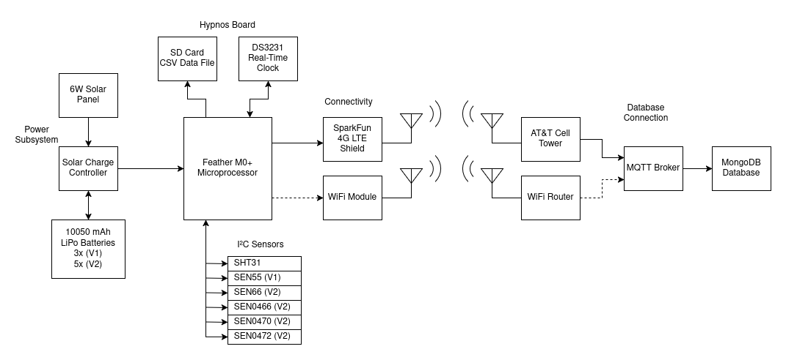

<!-- omit in toc -->
# Wisp
An open-source remote air quality sensing device made by OPEnS Lab OSU. The device logs air quality parameters to the MongoDB database.

Project leads: **Quinn Yockey** \<yockeyq@oregonstate.edu\>, **Shion Britten** \<brittesh@oregonstate.edu\>

<!-- omit in toc -->
## Abstract
Wildfires across Oregon, Washington, and California pose a significant threat to the wine industry through smoke taint, which negatively impacts wine quality. Accurate, high-resolution data on smoke exposure at the vineyard level is critical for risk assessment, yet commercial devices can be high cost. To address this, OPEnS Lab has developed Wisp, an Arduino-based air quality monitoring device:
* Data is being used with analysis of actual grape samples in effort to model smoke taint risk
* Measures 12 air quality parameters including particulate matter, CO₂, CO, SO₂
* Solar battery charger and 4G telemetry allows use in remote locations
* Low-cost (under $1500) compared to commercial competitors
* Open-source software and hardware

  
  
Figure 1: Deployed Wisp V2 Unit

  
  
Figure 2: Deployed Wisp V1 Unit

<!-- omit in toc -->
## Table of Contents
- [Operation](#operation)
- [Wisp V2](#wisp-v2)
  - [Upgrades From V1](#upgrades-from-v1)
  - [Wisp V2 Sensor Specs](#wisp-v2-sensor-specs)
- [Wisp V1](#wisp-v1)
  - [Wisp V1 Sensor Specs](#wisp-v1-sensor-specs)
- [Power Consumption](#power-consumption)
- [Deployment History](#deployment-history)
- [Resource List](#resource-list)
  - [Sensor Datasheets](#sensor-datasheets)
  - [LTE Board](#lte-board)
  - [SAMD Microprocessor](#samd-microprocessor)
  - [In-House PCB Schematics](#in-house-pcb-schematics)
  - [Bill of Materials](#bill-of-materials)
  - [Power Budget](#power-budget)
  - [Build Guide](#build-guide)

## Operation

  
  
Figure 3: Wisp block diagram

Due to the remote nature of most vineyard deployments, a convenient power source is usually not present.
A solar panel is used to recharge batteries, allowing indefinite operation as long as there is adequate sunlight.

Data is sampled from each sensor at a configurable interval, typically 5 minutes.
The data is then saved to an SD card in CSV format for future analysis.
Precise sleep control and SD data logging are made possible by the [Hypnos](https://github.com/OPEnSLab-OSU/OPEnS-Lab-Home/wiki/Hypnos) v3.3 board.

If available, Wisp devices can be configured to upload measured data to a centralized MongoDB database over a 4G LTE or WiFi network.
Data is sent using the MQTT protocol, allowing computer applications to subscribe to MQTT data stream feeds.
To save power, batches of sample data are accumulated and transmitted at a set interval, typically every 6 hours.
By aggregating data remotely, researchers can monitor environmental conditions and unit health across all deployment sites simultaneously.
This permits convenient near-real-time analysis of measured data without physically gathering the data from the SD card.

## Wisp V2

### Upgrades from V1

Like the V1, the Wisp V2 measures PM1, PM2.5, PM4, PM10, temperature, humidity,
VOC, and NOx.

The Wisp V2 improves upon the V1 by adding support for DFRobot's suite of MultiGas sensors for 12 different contaminants.
For vineyard deployments, the V2 uses the O₃ (SEN0472), CO (SEN0466), and SO₂ (SEN0470) sensors from DFRobot.
The particulate matter sensor was upgraded from the Sensirion SEN55 to the SEN66, providing readings with much lower noise as well as allowing for measurement of CO₂.

The V2 also features a complete case redesign, using a fully 3D-printed waterproof enclosure that improves access to the SD card.
The battery capacity is expanded from three 10050 mAh LiPo batteries to five, significantly improving operational runtime.

Work on the V2 began in 2025 and was completed by the start of the 2026 fire season.

### Wisp V2 Sensor Specs

| **Specification**                | **Sensor** | **Repeatability**                 | **Accuracy**                        | **Full Range**     |
| :---                             | :---:      | :---:                             | :---:                               | :---:              |
| Ambient Temperature              | SHT31      | ±0.07 °C                          | ±0.3 °C                             | -40 to 125 °C      |
| Humidity                         | SHT31      | ±0.015 %RH                        | ±2 %RH                              | 0 to 100 %RH       |
| Carbon Dioxide (CO₂)             | SEN66      | ±10 ppm                           | ±(50 ppm + 2.5 % m.v.)              | 0 to 40000 ppm     |
| **Specification**                | **Sensor** | **Repeatability**                 | **Device Variation**                | **Full Range**     |
| Volatile Organic Compounds (VOC) | SEN66      |±5 VOC index                       | ±15 VOC index                       | 1 to 500 VOC index |
| Nitrogen Oxides Index (NOx)      | SEN66      |±10 NOx index                      | ±50 NOx index                       | 1 to 500 NOx index |
| **Specification**                | **Sensor** | **Max Drift**                     | **Precision**                       | **Full Range**     |
| Particulate Matter 1.0 (PM1)     | SEN66      | ±1.25 μg/m³/yr to ±1.25 % m.v./yr | ±(5 μg/m³ + 5 % m.v.) to ±10 % m.v. | 0 to 1000 μg/m³    |
| Particulate Matter 2.5 (PM2.5)   | SEN66      | ±1.25 μg/m³/yr to ±1.25 % m.v./yr | ±(5 μg/m³ + 5 % m.v.) to ±10 % m.v. | 0 to 1000 μg/m³    |
| Particulate Matter 4.0 (PM4)     | SEN66      | ±1.25 μg/m³/yr to ±1.25 % m.v./yr | ±25 μg/m³ to ±25 % m.v.             | 0 to 1000 μg/m³    |
| Particulate Matter 10  (PM10)    | SEN66      | ±1.25 μg/m³/yr to ±1.25 % m.v./yr | ±25 μg/m³ to ±25 % m.v.             | 0 to 1000 μg/m³    |
| **Specification**                | **Sensor** | **Resolution**                    | **Accuracy**                        | **Full Range**     |
| Carbon Monoxide (CO)             | SEN0466    | 1 ppm                             | ±10%                                | 0 to 1000 ppm      |
| Sulfur Dioxide (SO₂)             | SEN0470    | 0.1 ppm                           | ±10%                                | 0 to 20 ppm        |
| Ozone (O₃)                       | SEN0472    | 0.1 ppm                           | ±10%                                | 0 to 10 ppm        |

## Wisp V1

### Wisp V1 Sensor Specs

| Specification              | Sensor | Resolution    | Accuracy      | Full Range        |
| :---                       | :---:  | :---:         | :---:         | :---:             |
| Ambient Temperature        | SHT31  | 0.01 °C       | ±0.3 °C       | -40 - 125 °C      |
| Humidity                   | SHT31  | 0.015 %RH     | ±3 %RH        | 0 - 100  %RH      |
| Particulate Matter 1.0     | SEN55  | ±5 μg/m³      | ±5 μg/m³      | 0 - 1000 μg/m³    |
| Particulate Matter 2.5     | SEN55  | ±5 μg/m³      | ±5 μg/m³      | 0 - 1000 μg/m³    |
| Particulate Matter 4       | SEN55  | ±25 μg/m³     | ±25 μg/m³     | 0 - 1000 μg/m³    |
| Particulate Matter 10      | SEN55  | ±25 μg/m³     | ±25 μg/m³     | 0 - 1000 μg/m³    |
| Volatile Organic Compounds | SEN55  | ±5 VOC index  | ±5 VOC index  | 1 - 500 VOC index |
| Nitrogen Oxides Index      | SEN55  | ±10 NOx index | ±10 NOx index | 1 - 500 NOx index |

  
  
Figure 5: Fully built Wisp V1 device

## Power Consumption

TODO Shion update with results from V1 and V2

The Wisp device draws approximately 20mA when initializing and 117mA during sensor polling. During transmission, the Wisp draws 305mA peak current. It sleeps for 5 minutes between data cycles, draws a nominal 5 mA, and peaks at 30 mA using just the battery. A Wisp can operate for approximately one month, transmitting every 6 hours using 5-minute sleep intervals.

## Deployment History

For the past four years, Wisp units have been deployed at 44 vineyards in Washington, Oregon, and California in order to monitor air quality.
This data is currently being analyzed by researchers at Oregon State University, Washington State University Tri Cities, and University of California Davis.

TODO replace with graphs showing fires

  
  
Figure 8: PM 2.5 graph from 6/25/25 - 9/3/25 in Washington

  
  
Figure 9: VOC index graph from 6/25/25 - 9/3/25 in Washington

## Resource List

* [Loom V4 Repository](https://github.com/OPEnSLab-OSU/Loom-V4)
* [MongoDB manual](https://docs.mongodb.com/manual/)

### Sensor Datasheets

* [Sensirion SEN55](https://sensirion.com/media/documents/6791EFA0/62A1F68F/Sensirion_Datasheet_Environmental_Node_SEN5x.pdf)
* [Sensirion SEN66](https://sensirion.com/media/documents/FAFC548D/693FBB15/PS_DS_SEN6x.pdf)
* [Sensirion SHT31](https://sensirion.com/media/documents/213E6A3B/63A5A569/Datasheet_SHT3x_DIS.pdf)
* [Maxim DS3231](https://www.analog.com/media/en/technical-documentation/data-sheets/DS3231.pdf)

### LTE Board

* [SparkFun LTE CAT M1/NB-IoT Shield - SARA-R4](https://www.sparkfun.com/sparkfun-lte-cat-m1-nb-iot-shield-sara-r4.html)
* [uBlox SARA-R410M-02B](https://mm.digikey.com/Volume0/opasdata/d220001/medias/docus/8899/SARA-R410M-02B.pdf)

### SAMD Microprocessor

* [Adafruit Feather M0 WiFi with uFL](https://www.adafruit.com/product/3061)
* [Atmel SAMD21G18A Cortex M0+ Microcontroller](https://cdn-learn.adafruit.com/assets/assets/000/044/363/original/samd21.pdf?1501106093)

### In-House PCB Schematics

* [Hypnos v3.3](asset/schematics/hypnos_v3.3.pdf)
* [Wisp V2](asset/schematics/wisp_v2.pdf)
* [Wisp V1](asset/schematics/wisp_v1.pdf)

### Bill of Materials

* [Wisp V2 Bill of Materials]() TODO
* [Wisp V1 Bill of Materials]() TODO

### Power Budget

* [Wisp V2 Power Budget]() TODO
* [Wisp V1 Power Budget]() TODO

### Build Guide

* [Wisp V2 Build Guide]() TODO
* [Wisp V1 Build Guide]() TODO
